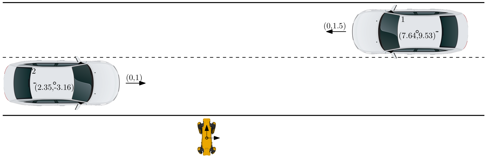
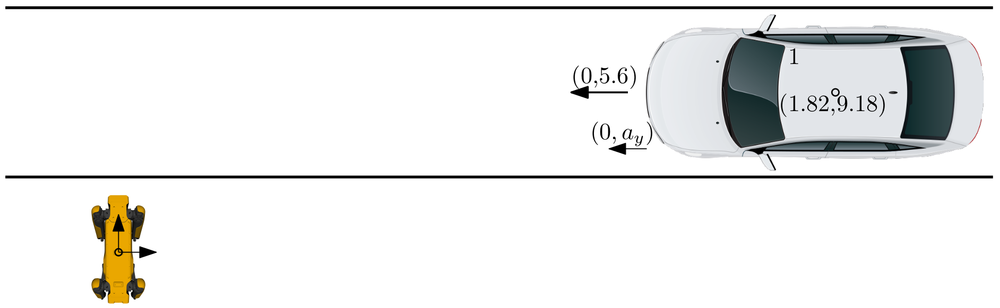
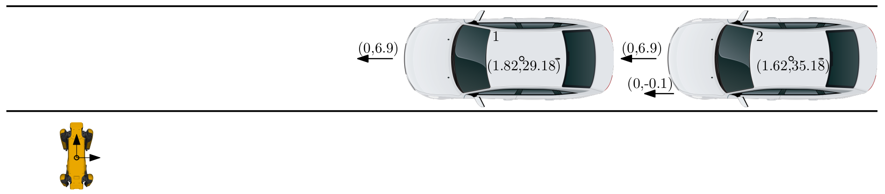
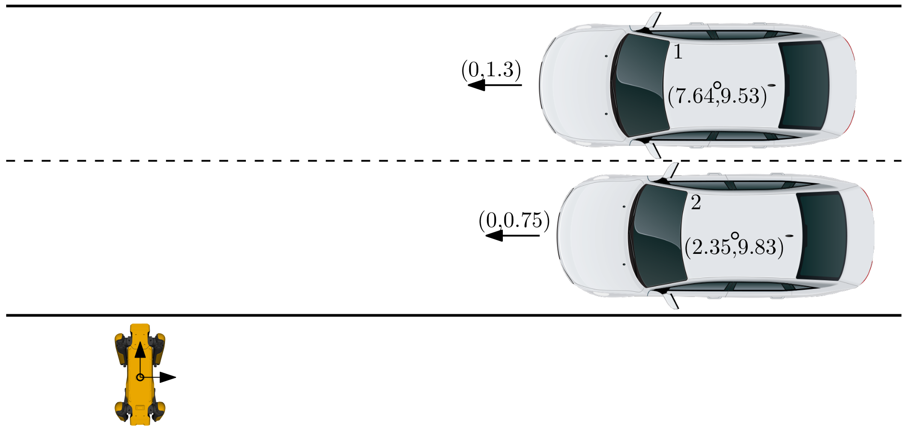
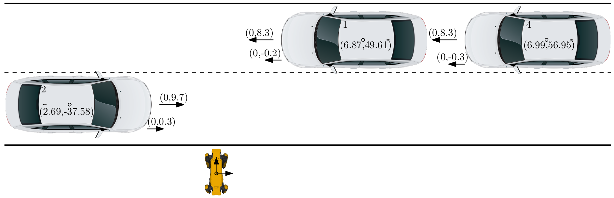

# Road crossing gazebo

## Description

This package contains the gazebo world and the gazebo plugins for simulation of the road crossing scenarios.

It was done as a part of my bachelor thesis at FEE CTU. The text of my bachelor thesis can be found [here](https://github.com/vlk-jan/bachelor_thesis).

This package was based on the simulator developed for RobInGas project available [here](https://github.com/ctu-vras/robingas_mission_gazebo). From this package we removed unnecessary parts and added the support for the road crossing package.

## Installation

The simulation was tested in simulator with Husky robot only.

- Install Husky simulation, [reference](http://wiki.ros.org/husky_navigation/Tutorials).
    ```bash
    sudo apt-get install ros-$ROS_DISTRO-husky-*
    echo "export HUSKY_GAZEBO_DESCRIPTION=$(rospack find husky_gazebo)/urdf/description.gazebo.xacro" >> ~/.bashrc
    source ~/.bashrc
    ```
- Configure the ROS workspace. Download the package and its dependencies and build it.
    ```bash
    mkdir -p ~/catkin_ws/src
    cd ~/catkin_ws/src

    git clone https://github.com/vlk-jan/road_crossing_gazebo

    wstool init
    wstool merge road_crossing_gazebo/dependencies.rosinstall
    wstool up -j 4

    cd ..
    catkin init
    catkin config --extend /opt/ros/$ROS_DISTRO
    catkin config --cmake-args -DCMAKE_BUILD_TYPE=Release
    catkin build
    source devel/setup.bash
    ```
- Download relevant Gazebo [models](http://subtdata.felk.cvut.cz/robingas/data/gazebo/models/) used in the virtual worlds and place them to `$HOME/.gazebo/models/` folder.

### Packages

- [Road crossing](https://github.com/vlk-jan/road_crossing)
- [Compass](https://github.com/ctu-vras/compass)
- [Ouster description](https://github.com/nlunscher-cpr/ouster_description)
- [Ouster example](https://github.com/wilselby/ouster_example)
- [Imu pipeline](https://github.com/ros-perception/imu_pipeline)
- GPS to path - previously part of [GPS navigation](https://github.com/ctu-vras/gps-navigation) package

## Usage

Start the simulation with Husky robot spawned:
```bash
roslaunch road_crossing_gazebo husky_gazebo.launch
```
Launch service nodes for the road crossing:
```bash
roslaunch road_crossing services.launch
```
Alternatively, you can start the simulation with Husky robot spawned and the service node for the road crossing:
```bash
roslaunch road_crossing_gazebo demo.launch
```
Launch the road crossing node:
```bash
roslaunch road_crossing crossing.launch
```
Simulate the vehicle detection node
```bash
rosrun road_crossing test_injector <scenario>
```
where `<scenario>` is one of the following:
- 1
    
- 2
    
    - 2.1 - the $a_{y}=1.7\ \rm{m s^{-2}}$
    - 2.2 - the $a_{y}=1\ \rm{m s^{-2}}$
    - 2.3 - the $a_{y}=2.3\ \rm{m s^{-2}}$
- 3
    
- 4
    
- 5
    

### Visualization of results

The results of the simulation can be visualized with script inside the road crossing package. The script can be run with the following command:
```bash
rosrun road_crossing process_logs.py <log_file>
```
where `<log_file>` is the path to the log file. The script will generate the plots and save them in the current directory.

The log file is not generated automaticaly, but the standard output of the road crossing node can be redirected to a file. The command to launch the road crossing node would look like this:
```bash
roslaunch road_crossing crossing.launch > <log_file>
```

## License

[](https://github.com/vlk-jan/road_crossing_gazebo/blob/master/LICENSE)
